# OpenFlex Quick Navigation
**World's First 27-DOF Open-Source Wheeled Dual-Arm Robot**

English | [中文](./README_CN.md)

---

[Official Docs](http://docs.openarmx.com/) | [GitHub Organization](https://github.com/openarmx)

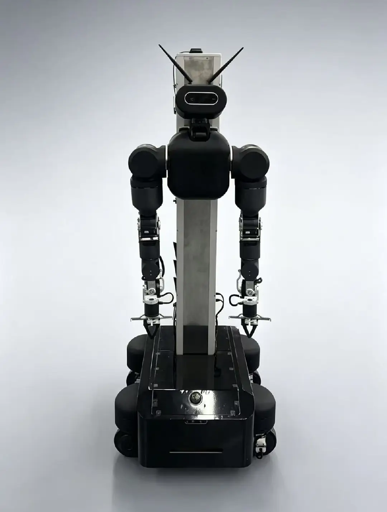

OpenFlex is an open-source full-body humanoid robot platform developed by Chengdu Changshu Robot Co., Ltd. Built on ROS 2, it integrates dual arms, mobile chassis, lift column, and head system, covering the full stack from robot description and low-level driving to VR teleoperation and autonomous navigation. This page summarizes the key information of the platform's core packages to help developers quickly locate the modules they need.

---

## Platform Features Overview

| Full-Body URDF | Chassis Model | Mapping | Navigation |
|:---:|:---:|:---:|:---:|
| 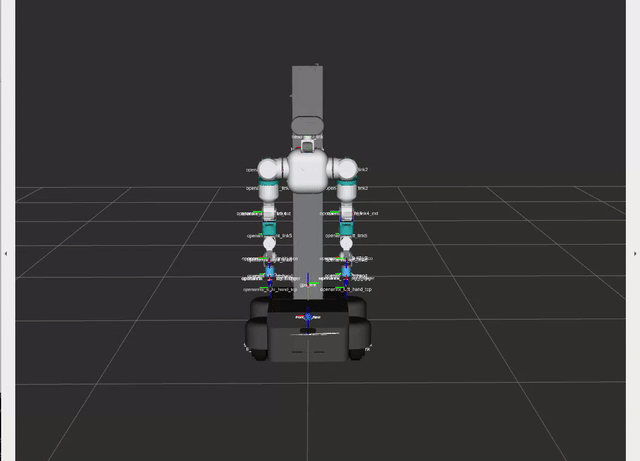 |  | 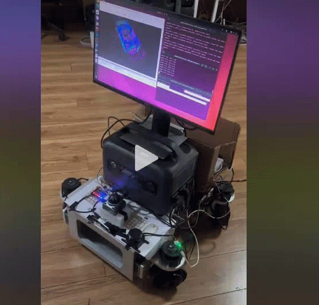 | 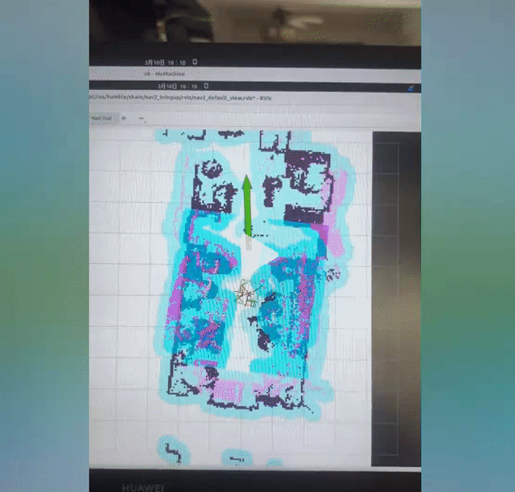 |
| **Lift-Slide URDF** | **Lift-Slide Bringup** | **Lift-Slide Tool** | **Head URDF** |
| 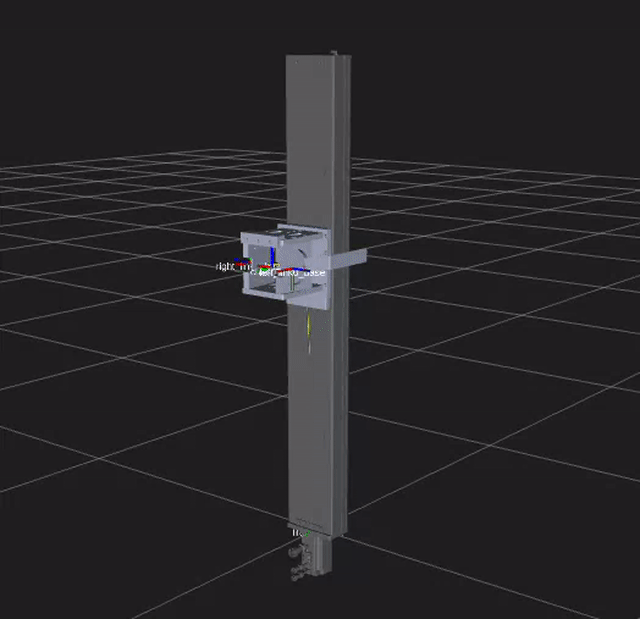 | 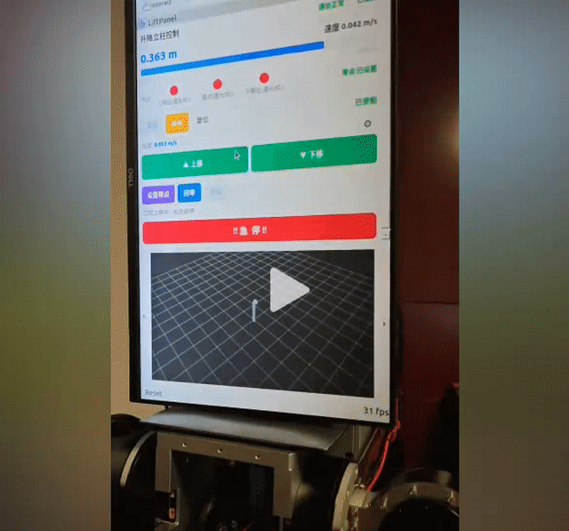 |  | 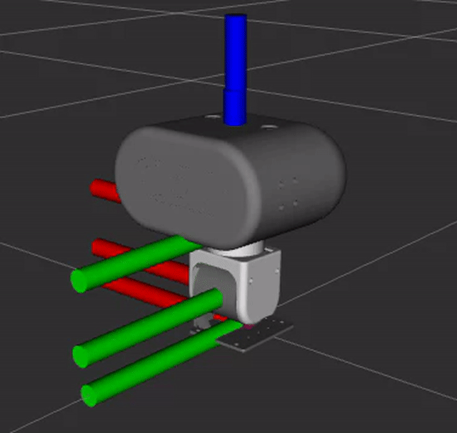 |
| **Head Bringup** | **Head VR Control** | **Head Vision** | **Exoskeleton Teleop** |
| 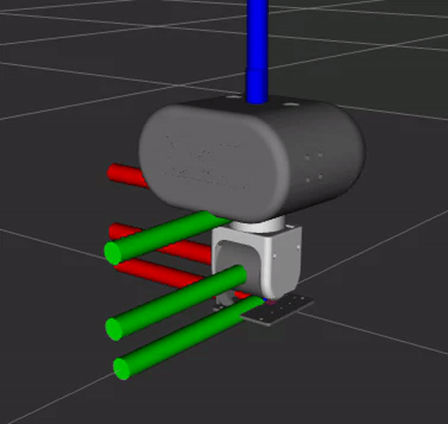 | 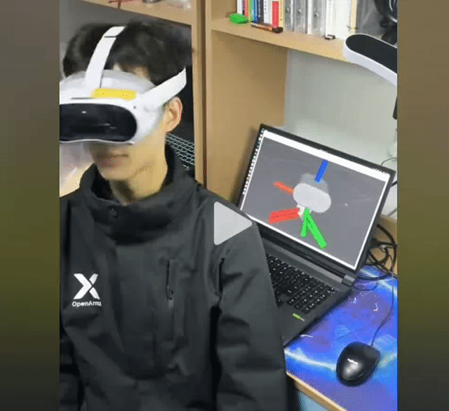 | 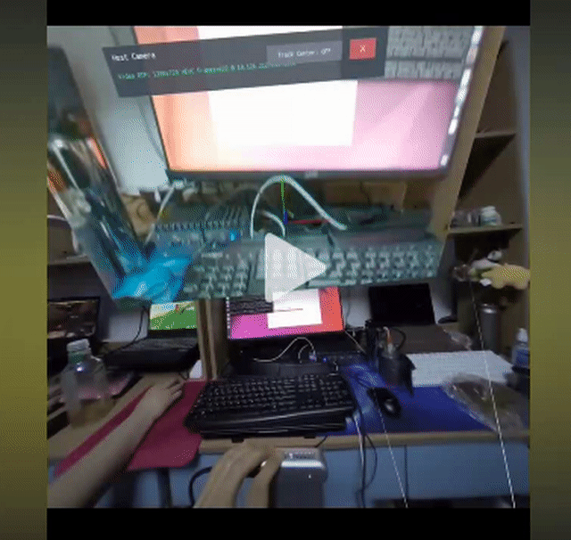 | 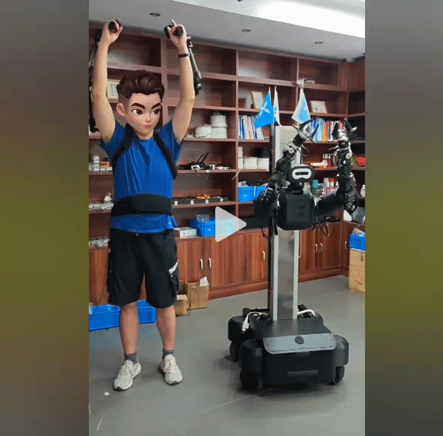 |
| **Integrated GUI** | **Manager GUI** | **System Bringup** | **VLA Module** |
| 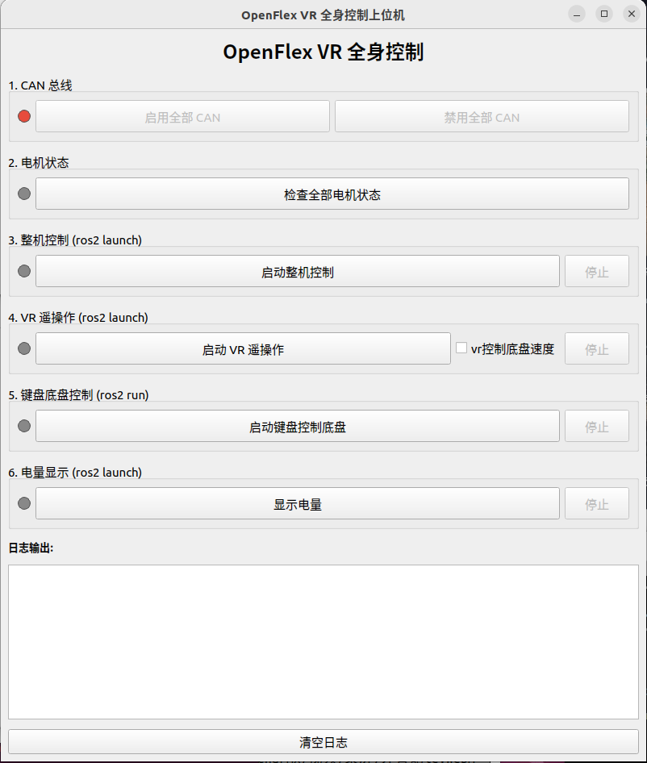 | 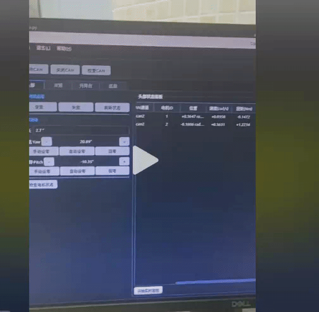 | 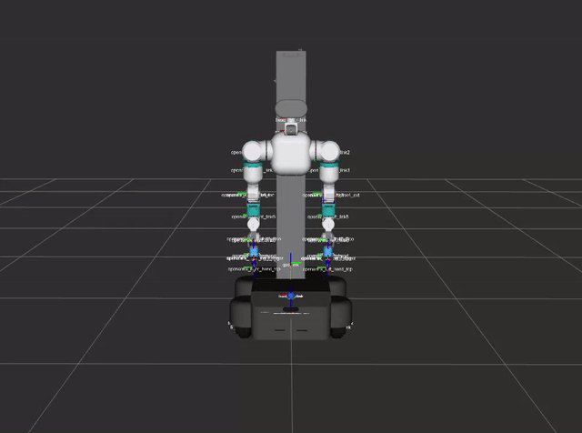 | 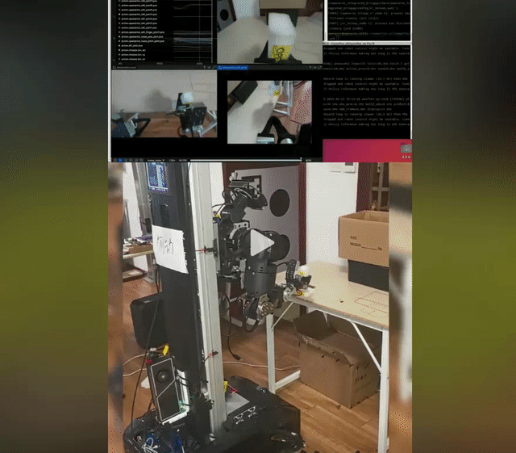 |

---

## Application Scenarios

| Precision Grasping | Robot Chef | Supermarket Picking | Tool Sorting |
|:---:|:---:|:---:|:---:|
| 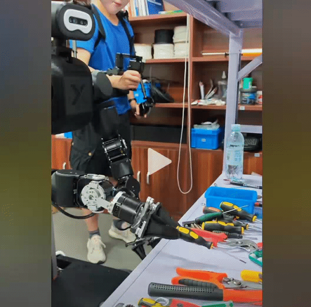 | 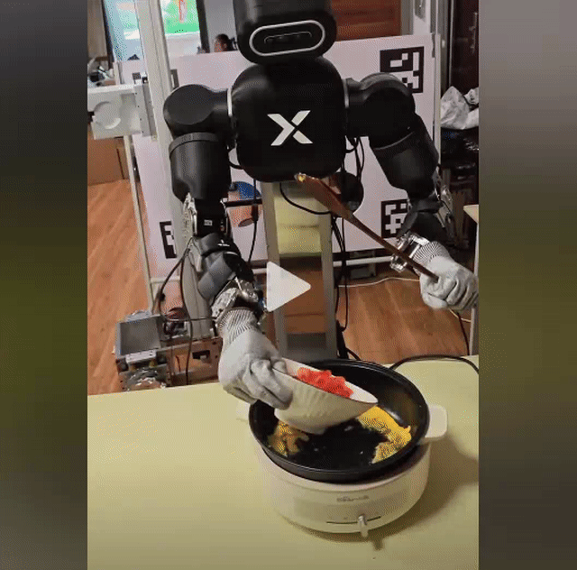 | 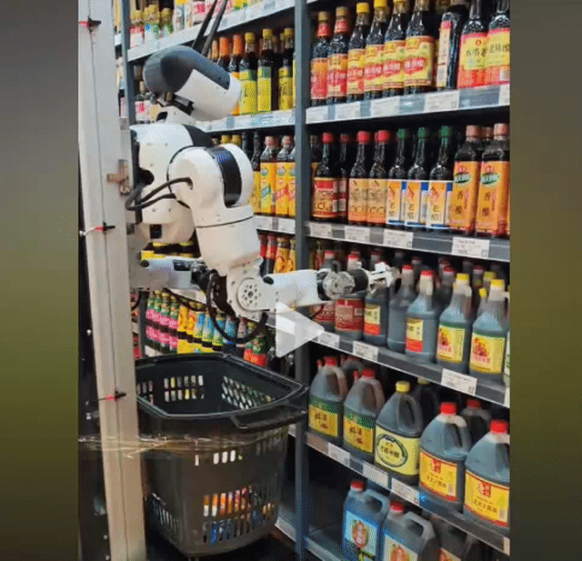 | 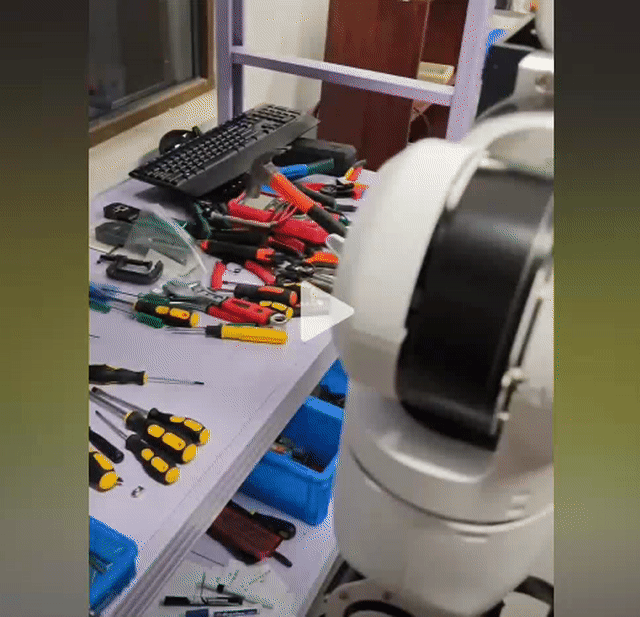 |
| **Archery** | **Fold Clothes** | **Stable Grasp of Low-ground Objects** | **3D Vision Hand-Eye Calibration** |
| 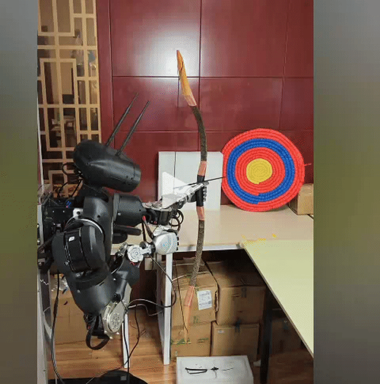 | 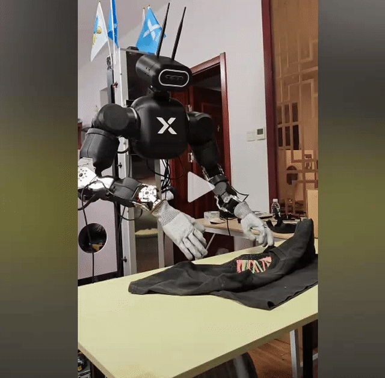 | 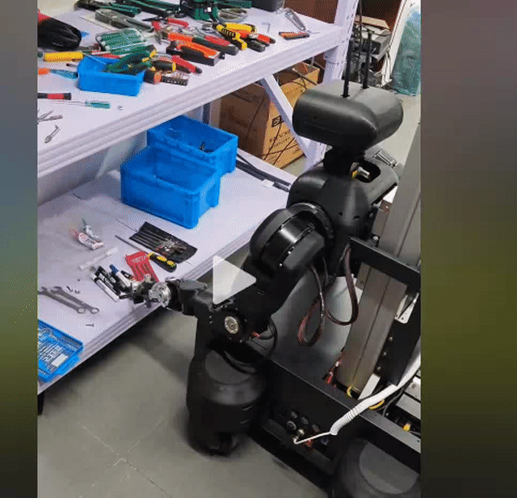 | 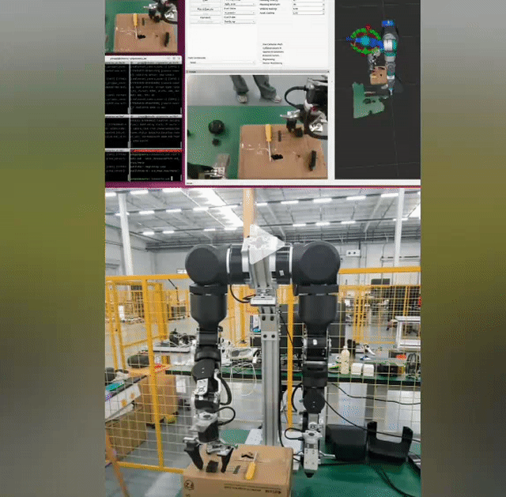 |

---

## Package Index

```
openflex_all/
├── openflex_drivers/                    # Driver packages (.deb, .whl)
├── openflex_maps/                       # Map files
├── openflex_models/                     # Model/weight files
└── openflex_ws/                         # ROS 2 workspace
    └── src/
        ├── OpenFlex/                    # Project docs and install scripts
        ├── openflex_integrated/   # Full-body integration
        │   ├── openarmx_integrated_bringup/
        │   ├── openarmx_integrated_description/
        │   ├── openflex_gui/
        │   └── openflex_manager/
        ├── openflex_chassis/            # Chassis subsystem
        │   ├── swerve_bringup/
        │   ├── swerve_hardware/
        │   ├── livox_ros_driver2/
        │   └── swerve_navigation/
        ├── openflex_lift_slide/         # Lift column subsystem
        │   ├── lift_slide_hardware/
        │   ├── lift_slide_description/
        │   └── lift_slide_msgs/
        ├── openflex_armx/               # Dual-arm subsystem
        │   ├── openarmx_bringup/
        │   ├── openarmx_hardware/
        │   ├── openarmx_description/
        │   └── openarmx_teleop_vr/
        ├── openflex_head/               # Head subsystem
        │   ├── openarmx_head_bringup/
        │   ├── openarmx_head_hardware/
        │   └── openarmx_head_description/
        ├── openflex_vr_bridge/          # VR pose bridge
        ├── openflex_EXO/           # Exoskeleton teleoperation
```

---

## Product Specifications

### OpenFleX Wheeled-Humanoid Robot

| Parameter | Standard Version | Ultra Version |
|:---:|:---:|:---:|
| **Degrees of Freedom** | Full-body 27 joints<br/>Head 2 DOF<br/>Left arm 8 DOF<br/>Right arm 8 DOF<br/>Lift 1 DOF<br/>Chassis 8 DOF | Full-body 27 joints<br/>Head 2 DOF<br/>Left arm 8 DOF<br/>Right arm 8 DOF<br/>Lift 1 DOF<br/>Chassis 8 DOF |
| **Chassis Type** | Omnidirectional (4-wheel swerve) | Omnidirectional (4-wheel swerve) |
| **Chassis Payload** | ~120kg | ~120kg |
| **Lift Range** | ~700mm | ~700mm |
| **Single Arm Reach** | ~714mm | ~714mm |
| **Dual-Arm Rated Payload** ¹ | ~10.0kg | ~10.0kg |
| **Dual-Arm Peak Payload** ² | ~24.0kg | ~24.0kg |
| **Total Weight** | ~200.0kg | ~200.0kg |
| **Communication** | CAN 2.0 1Mbps | CAN 2.0 1Mbps |
| **Power System** | 60Ah (30Ah × 2) | 60Ah (30Ah × 2) |
| **Structure Material** | Aluminum / Stainless Steel / 3D Printed | Aluminum / Stainless Steel / 3D Printed |
| **Domain Controller** | X86 Controller | X86 Controller [with RTX 3090 GPU] |
| **Software Platform** | Ubuntu22.04, ROS2 Humble,<br/>robot_description, robot_hardware, etc | Ubuntu22.04, ROS2 Humble,<br/>robot_description, robot_hardware, etc |
| **Perception System** | Head: Binocular RGB Vision × 1 | Head: RealSense D435i × 1<br/>Wrist: RealSense D405 × 2<br/>Chassis: Livox MID360S × 1<br/>+ RealSense D435i × 1 |
| **Motion Control** | ROS2_control real-time joint control<br/>MoveIt2 arm planning control | ROS2_control real-time joint control<br/>MoveIt2 arm planning control<br/>Nav2 chassis planning control |
| **Embodied Intelligence** | **VLA**: Lerobot VLA learning<br/>**RL**: Mujoco, NVIDIA Isaac reinforcement learning<br/>**Platform**: OpenClaw, DimOS | **VLA**: Lerobot VLA learning<br/>**RL**: Mujoco, NVIDIA Isaac reinforcement learning<br/>**Platform**: OpenClaw, DimOS |
| **Teleoperation** | PICO4 ULTRA VR / Meta Quest full-body teleoperation | PICO4 ULTRA VR / Meta Quest full-body teleoperation |
| **Optional Components** ³ | Dexterous Hand / OEM / ODM | Dexterous Hand / OEM / ODM |

**Notes:**
1. Dual-arm rated payload refers to the maximum weight that the J7 link can bear when a single arm is held horizontally for 1 minute.
2. Dual-arm peak payload refers to the maximum weight that the J7 link can bear when a single arm moves from vertical to horizontal position, holds for 1 second, and returns, with the entire process lasting about 3 seconds.
3. Optional components are configured according to customer requirements. We also provide customized development, OEM, and ODM services for embodied intelligent robots.

---

## 1. openflex_integrated

**Overview**
OpenFlex full-body humanoid robot integrated system that combines dual arms, chassis, lift column, and head subsystems, providing unified launch, control, and management interfaces.

**Contents**
- `openarmx_integrated_bringup`: Full-body system launch files, supporting real hardware and simulation modes
- `openarmx_integrated_description`: Complete robot URDF/Xacro description including kinematics and dynamics models of all subsystems
- `openflex_gui`: Qt5-based full-body robot graphical control panel
- `openflex_manager`: System manager providing control interfaces and status monitoring for each subsystem
- Integrated VR teleoperation launch file (`integrated_vr_teleop.launch.py`)
- Supports modular startup: can launch subsystems independently or as full-body integration

**Use Cases**
- Launch complete OpenFlex robot for full-body control
- VR immersive teleoperation of full-body system (dual arms + chassis + head)
- GUI graphical control and system status monitoring
- Full-body motion planning and testing in simulation environment

**Technical Features**
- ros2_control framework unified management of all joint controllers
- Automatic configuration file detection and creation (camera, LiDAR)
- Supports fake_hardware simulation mode
- 100Hz control frequency

---

## 2. openflex_chassis

**Overview**
OpenFlex mobile chassis and sensor subsystem, featuring 4-wheel independent swerve drive with integrated Livox MID-360 LiDAR, supporting FAST-LIO2 SLAM and Nav2 autonomous navigation.

**Contents**
- `swerve_bringup`: Chassis system launch files and controller configuration
- `swerve_hardware`: 4-wheel Swerve Drive hardware interface (RS06 steering motors + UM hub motors)
- `swerve_description`: Chassis URDF model
- `livox_ros_driver2`: Livox MID-360 LiDAR driver (with integrated user config auto-loading)
- `swerve_navigation`: SLAM mapping and Nav2 navigation configuration
  - FAST-LIO2 real-time mapping (with PGO loop closure)
  - ICP localization
  - Nav2 autonomous navigation and obstacle avoidance
- CAN communication: can4 (drive motors) + can5 (steering motors)

**Use Cases**
- Precise motion control of omnidirectional mobile chassis
- Indoor environment SLAM mapping and autonomous navigation
- LiDAR point cloud acquisition and processing
- Mobile manipulation in coordination with dual-arm system

**Technical Features**
- Swerve Drive algorithm for omnidirectional movement
- User config auto-loading (`~/.openflex/lidar_config.yaml`)
- Simplified LiDAR IP configuration (only last 2 digits required)
- FAST-LIO2 high-precision real-time mapping
- PGO loop closure detection for map optimization
- Nav2 DWB local planner

---

## 3. openflex_head

**Overview**
OpenFlex 2-DOF head subsystem driven by Robstride RS00 motors, supporting VR headset tracking and independent control.

**Contents**
- `openarmx_head_bringup`: Head system launch files (100Hz control frequency)
- `openarmx_head_hardware`: ros2_control hardware interface, supporting MIT/CSP dual control modes
- `openarmx_head_description`: Head 2-DOF URDF model (yaw + pitch)
- `openarmx_head_teleop_vr_pico`: Pico VR headset tracking control
- `openarmx_head_visio_h264`: Head camera H.264 video stream forwarding
- `openarmx_head_joint_slider_panel`: RViz2 head joint slider control panel
- CAN communication: can2 (2x RS00 motors)

**Use Cases**
- VR headset direction tracking with real-time head following
- Head camera video stream real-time forwarding to VR headset
- Independent head joint position control
- Coordinated motion with full-body system integration

**Technical Features**
- Joint limits: yaw ±90°, pitch ±90°
- Max velocity: 33 rad/s
- Automatic homing function (optional on startup)
- Soft limit smooth transition
- Relative direction tracking mode

---

## 4. openflex_lift_slide

**Overview**
OpenFlex single-axis vertical lift column subsystem controlled via CANopen protocol, providing waist height adjustment function.

**Contents**
- `lift_slide_hardware`: Lift column CANopen hardware interface
- `lift_slide_description`: Lift column URDF model
- `lift_slide_msgs`: Lift column message definitions
- `lift_slide_panel`: RViz2 lift column control panel
- CAN communication: can3 (CANopen, Node ID 16)

**Use Cases**
- Adjust robot waist height to adapt to different work surfaces
- Waist lift control during VR teleoperation
- Full-body motion in coordination with chassis movement

**Technical Features**
- Stroke range: -0.650m ~ +0.300m
- Max velocity: 0.10 m/s
- Position accuracy: ±0.5mm
- Limit switch protection
- Home switch automatic zeroing

---

## 5. openflex_armx

**Overview**
OpenFlex dual 7-DOF manipulator subsystem based on openarmx-6.0_basic, driven by Robstride motors, supporting multiple teleoperation methods.

**Contents**
- Refer to [openarmx-6.0_basic](../openarmx-6.0_basic/README.md) for complete documentation
- Dual-arm CAN communication: can1 (left arm) + can2 (right arm)
- Integrated MoveIt2 motion planning
- Supports VR, exoskeleton, and bimanual teleoperation

**Use Cases**
- Dual-arm coordinated operation and teaching
- VR immersive dual-arm teleoperation
- Trajectory recording and playback
- VLA data collection

**Technical Features**
- 7-DOF × 2 arm configuration
- Robstride motor CAN bus control
- MIT/CSP dual control modes
- Gravity compensation support

---

## 6. openflex_vr_bridge

**Overview**
Pico VR device pose bridge package that receives VR controller data via UDP and publishes as ROS 2 topics, serving as the data entry point for VR teleoperation.

**Contents**
- `pico_pose_bridge_node` (C++): UDP port 5100 listener, publishes controller poses, buttons, triggers, etc.
- VR APK installation packages (`../openflex_vr_apk/apk/pico/OpenFlex.apk` or `../openflex_vr_apk/apk/quest/openarmx-vr-quest.apk`)
- Supports dual controller 6-DOF pose tracking
- Button mapping: A button (return to zero), B button, triggers, grips

**Use Cases**
- Data source for all VR teleoperation
- Supports dual-arm VR IK teleoperation
- Head VR tracking
- Chassis joystick control

**Technical Features**
- UDP real-time communication (~90Hz)
- Low-latency pose data transmission
- Complete button state publishing
- Optional TF tree publishing

---

## 7. openflex_moveit_nav2

**Overview**
OpenFlex's MoveIt2 motion planning and Nav2 navigation integration package, providing full-body coordinated motion planning and autonomous navigation capabilities.

**Contents**
- Dual-arm MoveIt2 configuration
- Nav2 navigation parameter configuration
- Full-body coordination planning interface
- Mobile manipulation integration

**Use Cases**
- Dual-arm trajectory planning and collision avoidance
- Mobile chassis autonomous navigation
- Mobile manipulation tasks (navigation + grasping)

**Technical Features**
- MoveIt2 OMPL planner
- Nav2 DWB controller
- Full-body collision detection
- Real-time replanning

---

## 8. openflex_vla

**Overview**
Vision-Language-Action (VLA) data collection and model training package based on LeRobot framework, supporting multi-camera synchronized data collection and ACT model training.

**Contents**
- Data collection script (`lerobot_record_openflex.py`)
- 4x RealSense camera synchronization
- VR teleoperation data recording
- ACT model training configuration
- Inference deployment scripts

**Use Cases**
- VR teleoperation teaching data collection
- Dual-arm operation dataset construction
- ACT imitation learning model training
- Policy model online inference

**Technical Features**
- Multi-camera time synchronization
- HDF5 data format
- Supports LeRobot ecosystem
- GPU training acceleration

---

## 🚀 Quick Start

### 1.1 Build

If you are using the officially configured host, you can skip this chapter and read : [openflex-documentation(Basic).md](openflex-documentation(Basic).md) directly.

---

## 🎮 VR Teleoperation Features

### A Button Return to Zero Mechanism
- **Function**: Press right controller A button, dual arms' 14 joints return to 0° simultaneously
- **Features**:
  - Smooth motion with 8°/cycle step limit
  - Completion condition: all joint errors <0.01rad
  - Cancellable mid-way (press A again)
  - Gripper state maintained

### Other Controls
- **Triggers**: Dual-arm IK control
- **Joysticks**: Chassis movement (when enabled)
- **Head Tracking**: VR headset direction following

---

## License

This package is licensed under Creative Commons Attribution-NonCommercial-ShareAlike 4.0 International License (CC BY-NC-SA 4.0).

Copyright (c) 2026 Chengdu Changshu Robot Co., Ltd.

For details, please refer to the [LICENSE](LICENSE) file or visit: http://creativecommons.org/licenses/by-nc-sa/4.0/

## Acknowledgments

This package is part of the OpenFlex full-body humanoid robot platform ecosystem, developed specifically for research and industrial applications in the humanoid robotics field.

---

## 📞 Contact Us

### Chengdu Changshu Robot Co., Ltd.
**Chengdu Changshu Robotics Co., Ltd.**

| Contact | Information |
|---------|-------------|
| 📧 Email | openarmrobot@gmail.com |
| 📱 Phone/WeChat | +86-17746530375 |
| 🌐 Website | https://openarmx.com/ |
| 🌐 Docs | http://docs.openarmx.com/ |
| 📍 Address | Tianjin Xiqing District · Daochao Robot Experience Base (City of Tomorrow) · Tianjin Humanoid Robot Center |
| 👤 Contact Person | Mr. Wang |
